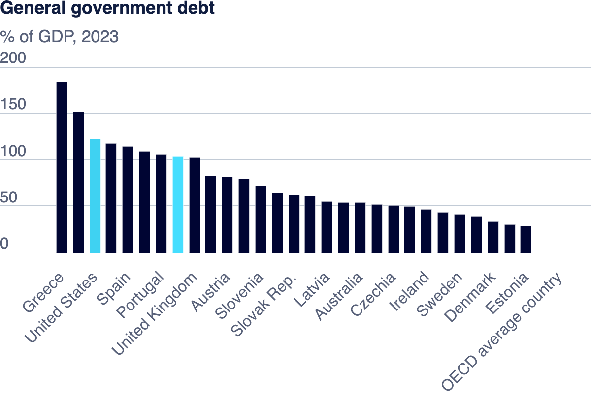

| [Home](https://hjayanne.github.io/Portfolio_hjayanne/) |[News_Media](newsdemo)| [Visualizing Debt](visualizing-government-debt) | [Assignment 3&4](critique-by-design) | [Final Project I](final-project-part-one) | [Final Project II](final-project-part-two) | [Final Project III](final-project-part-three) |

# General Government _Debt-to-GDP Ratio_ Visualizations
We will be analysing the global debt-to-GDP ratios of various countries using four different visulaizations. Under each section, I have explained why this visualization was chosen, what story it is telling, how different it is from the others, the pre-attentive features selected, and some more details to help anyone who wants to recreate the same. With each visualization we can see what they are highlighting like - a bar chart is showing 2023 ratios of US and Canada and how it compares to other countries, a heat map would show which countries had a good/bad ratio using colors, a line graph would help in trend identification based on the timeline till 2019, and a map would show countries that had a good/bad ratio in 2019.

## Part one: Working with web-based visualization tools and data
This is a bar graph of all countries that reported _General government debt_ in 2023, an our focus is drawn to the North American countries: _US_ and _Canada_ here.

 

## Working with Tableau
I tried visualizing the **debt-to-GDP** ratios of countries in the best way - first with the line plots, but it didn't help in identifying which countries had a higher or lower ratio, so I used a **highlight table** with an Orange-Blue diverging color palette to show countries with a **low debt-to-GDP ratio (_less than 100_)** in shades of **blue** and the ones with a **higher ratio** are shown in shades of **orange**. For example, **Japan** in 2018 had the highest debt-to-GDP ratio of **238.7** which is reflected by the dark orange in that cell entry. Some countries that didn't report any data are left blank with a white space in our table. Although this table helps in visulaizing all the data we have, it is a little cumbersome to scroll through to find specific countries or the highest value for a particular year, etc., so we try a few **different visualizations** for the same data for someone to focus only on **North American countries** with a **line plot** and a **global view** of the most recent year(2019) and which countries have a good/bad debt-to-GDP ratio using a **map** below.

<noscript></noscript><object class='tableauViz'  style='display:none;'><param name='host_url' value='https%3A%2F%2Fpublic.tableau.com%2F' /> <param name='embed_code_version' value='3' /> <param name='site_root' value='' /><param name='name' value='Govt_Debt_Visualization&#47;Debt-to-GDPRatioAcrossTheGlobe' /><param name='tabs' value='no' /><param name='toolbar' value='yes' /><param name='static_image' value='https:&#47;&#47;public.tableau.com&#47;static&#47;images&#47;Go&#47;Govt_Debt_Visualization&#47;Debt-to-GDPRatioAcrossTheGlobe&#47;1.png' /> <param name='animate_transition' value='yes' /><param name='display_static_image' value='yes' /><param name='display_spinner' value='yes' /><param name='display_overlay' value='yes' /><param name='display_count' value='yes' /><param name='language' value='en-US' /><param name='filter' value='publish=yes' /></object>
                

## Part three: create your own visualization

### NA Debt-to-GDP Ratio - Line plot
I used a line graph representation here because for a data visualization that includes time variable in it, a line plot if used well can tell a good story. This is **different** from other vizzes, as it gives the viewer an idea about how the **trends** are for **Canada** and the **United States** up until 2019. I made a few changes like changing the colors of all the countries except the ones that fall under **North America** to light grey and to focus on NA, I used **Orange for Canada** and **Dark Green for USA** using a filter for location. By just looking at the graph, we can see that **Canada's debt-to-GDP ratio has reduced** gradually, wheras for the **United States, the ratio has steadily increased** which could mean they have been taking more and more debt throughout the timeline, but has maintained a steady rise close to 140. 

<noscript></noscript><object class='tableauViz'  style='display:none;'><param name='host_url' value='https%3A%2F%2Fpublic.tableau.com%2F' /> <param name='embed_code_version' value='3' /> <param name='site_root' value='' /><param name='name' value='NADebt-to-GDPRatio-Lineplot&#47;NADebt-to-GDPRatio-Lineplot' /><param name='tabs' value='no' /><param name='toolbar' value='yes' /><param name='static_image' value='https:&#47;&#47;public.tableau.com&#47;static&#47;images&#47;NA&#47;NADebt-to-GDPRatio-Lineplot&#47;NADebt-to-GDPRatio-Lineplot&#47;1.png' /> <param name='animate_transition' value='yes' /><param name='display_static_image' value='yes' /><param name='display_spinner' value='yes' /><param name='display_overlay' value='yes' /><param name='display_count' value='yes' /><param name='language' value='en-US' /><param name='filter' value='publish=yes' /></object>
                

### 2019 Global Debt-to-GDP Ratios
I focussed on the most recent year the data was available from our source:OECD-**2019** by filtering the Time attribute. I also changed the **data type of Location** to show **Country/Region** codes, so that I can use a **map** to visualize it. This is similar to the heatmap but _focussed solely on **2019 data** and gives us a **global view** with the map_, with a **red-green diverging** color palette with 100 debt-to-GDP ratio as the center. This way the **countries having a lower ratio < 100** are displayed in shades of **red**, and **countries with a higher ratio** are shown in shades of **green**. We can take one look at the map and see that **USA and Canada have a high ratio**, and **Australia** and a **few countries in Europe** have a **lower ratio**. If we are showing this to a **stakeholder** like the **common people**, they will ask why there is **no data** for all the other region? This could trigger an action in prompting these countries to report their data asap to understand how the global debt-to-GDP ratio varies. 

<noscript></noscript><object class='tableauViz'  style='display:none;'><param name='host_url' value='https%3A%2F%2Fpublic.tableau.com%2F' /> <param name='embed_code_version' value='3' /> <param name='site_root' value='' /><param name='name' value='2019GlobalDebt-to-GDPRatios&#47;2019GlobalDebt-to-GDPRatios' /><param name='tabs' value='no' /><param name='toolbar' value='yes' /><param name='static_image' value='https:&#47;&#47;public.tableau.com&#47;static&#47;images&#47;20&#47;2019GlobalDebt-to-GDPRatios&#47;2019GlobalDebt-to-GDPRatios&#47;1.png' /> <param name='animate_transition' value='yes' /><param name='display_static_image' value='yes' /><param name='display_spinner' value='yes' /><param name='display_overlay' value='yes' /><param name='display_count' value='yes' /><param name='language' value='en-US' /><param name='filter' value='publish=yes' /></object>
                

## Thank you!
